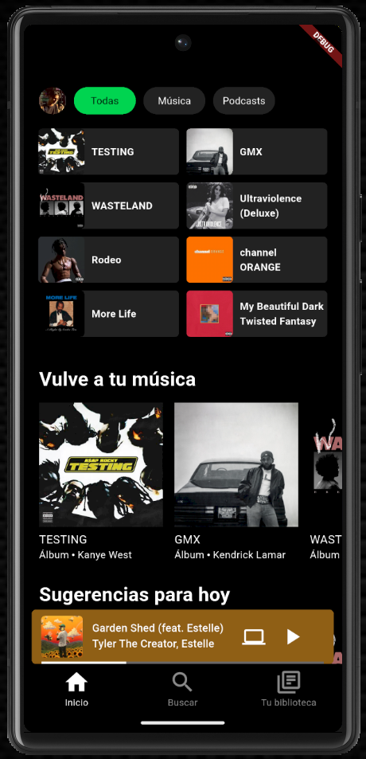

# Flutter Spotify UI Clone
Aplicación móvil desarrollada en Flutter con el objetivo de mejorar habilidades en diseño de interfaces y arquitectura de aplicaciones móviles.

## Descripción General
Flutter Spotify UI Clone es un proyecto personal y educativo enfocado en fortalecer habilidades en el desarrollo de aplicaciones móviles utilizando Flutter y Dart.

El proyecto consiste en un clon visual de Spotify, recreando su estructura principal, navegación y componentes UI, sin conexión a un backend real ni servicios de streaming.
El enfoque principal está en layout, widgets personalizados, organización del código y buenas prácticas en Flutter.

Incluye:

- Pantalla principal (Home)
- Barra superior personalizada (AppBar)
- Barra de navegación inferior (Bottom Bar)
- Secciones de álbumes y canciones
- Componentes UI reutilizables
- Navegación entre pantallas
- Arquitectura modular por pantallas

## Características Principales

Clon visual de la interfaz de Spotify 
Desarrollo 100% en Flutter 
Componentes personalizados (AppBar, BottomBar, Floating Button) 
Navegación entre vistas 
Organización modular del código 
Buenas prácticas en UI y layout 
Proyecto enfocado en aprendizaje y práctica 

## Tecnologías Utilizadas
### Mobile

- Flutter
- Dart
- Material Design
- Widgets personalizados

### Tooling

- Flutter SDK
- Android Studio / VS Code
- Git & GitHub
- FileTree Pro (documentación del repositorio)

## Arquitectura del Proyecto

El proyecto está organizado de forma modular para facilitar la lectura, mantenimiento y escalabilidad del código.

```bash
/lib
├── pages
│   ├── home
│   │   ├── appBar
│   │   │   └── custom_app_bar.dart
│   │   ├── body
│   │   │   ├── up_body.dart
│   │   │   ├── custom_body.dart
│   │   │   └── bottom_body.dart
│   │   ├── bottomBar
│   │   │   ├── custom_bottom_bar.dart
│   │   │   └── floating_button.dart
│   │   └── home_page.dart
│   ├── albums.dart
│   └── song.dart
└── main.dart
```

### Enfoque Arquitectónico
- Separación por pantallas y componentes
- Widgets reutilizables
- Código claro y fácil de extender
- Preparado para futuras mejoras (estado, backend, animaciones)


Estas clases son utilizadas por Backend y Frontend como librería.

## Requisitos Previos

Asegúrate de tener instalado:

- Flutter SDK
- Dart
- Android Studio o VS Code
- Emulador Android / iOS o dispositivo físico

## Instalación y Ejecución
1. Clonar el repositorio

```bash
git clone https://github.com/sebastian-alpizar/flutter-spotify-ui-clone.git
cd flutter-spotify-ui-clone
```

### Configuración del Backend
2. Obtener dependencias
```bash
flutter pub get
```

3. Ejecutar la aplicación
```bash
flutter run
```

Flujo de la Aplicación

1. El usuario ingresa a la pantalla Home
2. Visualiza la AppBar personalizada
3. Navega por álbumes y canciones
4. Interactúa con la barra inferior
5. Accede a vistas de álbumes y canciones

⚠️ Nota: Este proyecto no consume APIs reales ni reproduce música.
Está diseñado únicamente para práctica de UI y arquitectura en Flutter.

## Ejemplos Visuales


## Testing

Los módulos están estructurados para facilitar pruebas unitarias y pruebas manuales:

- Pruebas de sockets
- Simulación de múltiples Frontend
- Validación de concurrencia en el Backend
- Pruebas de transferencia de facturas

## Objetivo del Proyecto
Este proyecto fue desarrollado con el objetivo de:

- Mejorar habilidades en Flutter
- Practicar layouts complejos
- Comprender la composición de widgets
- Organizar proyectos Flutter de forma profesional
- Reforzar conceptos de navegación y reutilización de componentes


## Posibles Mejoras Futuras

- Manejo de estado (Provider / Riverpod / Bloc)
- Animaciones
- Consumo de una API real
- Reproductor de audio
- Modo oscuro
- Responsive design

## Autor

**Desarrollado por Sebastián Alpízar Porras**  
GitHub: https://github.com/sebastian-alpizar  
Email: sebastianalpiz@gmail.com
